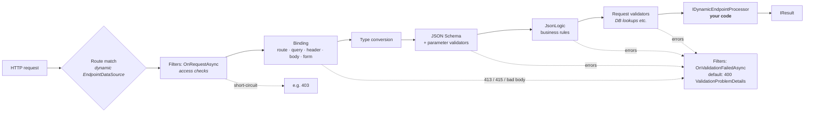
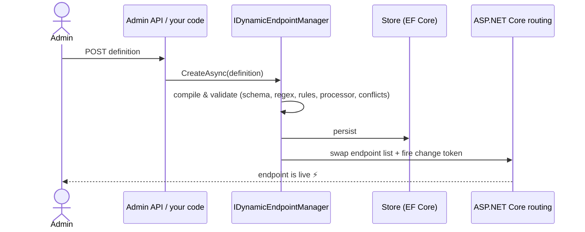

<div align="center">

# ⚡ DynamicEndpoints

### Runtime-defined HTTP endpoints for ASP.NET Core.
**Click it in a panel → it's live. Restart the app → it's still there.**

[](https://github.com/doctorspider42/dotnet-dynamic-endpoints/actions/workflows/ci.yml)
[](https://www.nuget.org/packages/DynamicEndpoints)
[](#-packages)
[](LICENSE)
[](https://dotnet.microsoft.com/)
[](https://learn.microsoft.com/aspnet/core/fundamentals/minimal-apis)
[](https://spec.openapis.org/oas/v3.1.0)
[](https://json-schema.org/)
[](#-contributing)
[](https://github.com/doctorspider42/dotnet-dynamic-endpoints/stargazers)

[Quick start](#-quick-start) •
[Features](#-features) •
[How it works](#-how-it-works) •
[Validation](#%EF%B8%8F-validation-four-layers-zero-recompiles) •
[Docs](#-documentation) •
[Changelog](CHANGELOG.md) •
[Sample app](#-sample-app)


</div>

---

## 🤔 Why?

Your client wants to **define, publish and change HTTP endpoints from an admin panel**, with their own parameters,
their own validation and no deployment. The usual answers are bad:

- ❌ **"We'll add it in the next sprint"**: every new endpoint is a release.
- ❌ **"Admins can write C# in a textbox"**: that's remote code execution shipped as a feature.
- ❌ **A catch-all route with a hand-rolled dispatcher**: you lose authorization, rate limiting, OpenAPI and everything else routing gives you.

**DynamicEndpoints** takes a fourth path. Admins *configure* endpoints and developers write the *building blocks*.
Endpoints are real ASP.NET Core `RouteEndpoint`s, created and removed at runtime, persisted in your database and documented in Swagger.

```
admin clicks "publish"  →  validated  →  persisted  →  routable on every instance. No restart, no recompile.
```

## ✨ Features

| | |
|---|---|
| 🔥 **Hot endpoints** | Add, change, disable and delete endpoints at runtime. Routing swaps atomically, so a request never sees a half-applied state. |
| 💾 **Persistent** | Stored with EF Core (any provider) and loaded on start-up. Optimistic concurrency included. |
| 🧩 **Declarative binding** | Route, query, header, JSON body and form parameters with types, defaults and request names (`X-Tenant-Id` → `tenantId`). |
| 📎 **File uploads** | `multipart/form-data` with size and content-type limits, streamed by ASP.NET Core. No base64, documented as binary in OpenAPI. |
| 🛡️ **Four layers of validation** | JSON Schema constraints, custom C# validators, JsonLogic business rules, FluentValidation. |
| 🪝 **Filters** | Access checks before validation, your own error format, logging and metering of rejected requests. |
| 🌍 **Localized errors** | English and Polish built in, every message overridable, stable error codes for clients. |
| 📧 **Built-in formats** | E-mail, URI, phone (E.164), IPv4/IPv6, time, date, date-time, UUID. No code needed. |
| 🪶 **Zero dependencies** | The core depends on ASP.NET Core only. The JSON Schema subset and the JsonLogic engine are built in. |
| ⚙️ **Processors** | Your code, your DI, your database. Validated input goes to a regular, statically typed handler. |
| 📜 **OpenAPI 3.1 + Swagger UI** | Generated from the definitions and always current. Business rules show up in the docs. |
| 🔐 **First-class citizens** | Authorization policies, rate limiting, CORS and endpoint conventions behave the same as on hand-written endpoints. |
| 🚦 **Safe by design** | No code execution, ReDoS-proof regexes, body and depth limits, reserved prefixes, conflict detection. |
| 🌐 **Multi-instance** | Polling refresh out of the box, plus a hook for push-based propagation (Redis, a message bus, …). |
| 🪄 **Assembly scanning** | `AddFromAssemblyContaining<Program>()` registers every processor, validator and seeder in one call. |
| 🖥️ **Admin REST API** | One line, `MapDynamicEndpointsAdmin()`, or build your own on top of `IDynamicEndpointManager`. |
| ✅ **Tested** | Integration tests run on TestServer + SQLite: persistence across restarts, multiple instances, concurrency. |

## 🚀 Quick start

```bash
dotnet add package DynamicEndpoints
dotnet add package DynamicEndpoints.EntityFrameworkCore   # persistence
dotnet add package DynamicEndpoints.FluentValidation      # optional
```

```csharp
var builder = WebApplication.CreateBuilder(args);

builder.Services.AddDbContext<AppDbContext>(o => o.UseSqlite("Data Source=app.db"));

builder.Services
    .AddDynamicEndpoints()
    .AddFromAssemblyContaining<Program>()          // all processors, validators & seeders
    .UseEntityFrameworkStore<AppDbContext>();      // persistence

var app = builder.Build();

app.MapDynamicEndpoints();                                         // 🔥 the dynamic routes
app.MapDynamicEndpointsAdmin("/api/admin/endpoints")               // 🖥️ management API
   .RequireAuthorization("admin");
app.MapDynamicEndpointsOpenApi("/openapi/dynamic.json");           // 📜 OpenAPI 3.1
app.UseSwaggerUI(c => c.SwaggerEndpoint("/openapi/dynamic.json", "Dynamic API"));

app.Run();
```

Add the table to your context with `modelBuilder.ApplyDynamicEndpointsConfiguration();` and you're done.

### Your first endpoint, from code

```csharp
public sealed class OrdersSeeder(IDynamicEndpointManager manager) : IDynamicEndpointSeeder
{
    public async Task SeedAsync(CancellationToken ct)
    {
        if ((await manager.ListAsync(ct)).Count > 0) return;

        await manager.CreateAsync(DynamicEndpoint.Post("/orders/{customerId}")
            .Named("Create order")
            .InGroup("Orders")
            .HandledBy<OrderProcessor, OrderConfig>(new() { Queue = "incoming" })   // typed, no magic strings
            .FromRoute("customerId", p => p.String().Pattern("^C[0-9]{3}$"))
            .FromHeader("tenantId", p => p.BindFrom("X-Tenant-Id").Required())
            .FromBody("quantity", p => p.Integer().Required().Range(1, 100))
            .FromBody("deliveryDate", p => p.Date().Required())
            .FromBody("contactEmail", p => p.Email().Required())
            .FromBody("nip", p => p.ValidatedBy<NipValidator>())
            .WithRule("""{ ">=": [{ "var": "quantity" }, 10] }""", "Wholesale orders only.", "quantity")
            .ValidatedBy<CreditLimitValidator>(), ct);
    }
}
```

…or let an admin click the same thing together in a panel. 🖱️

`HandledBy<T>()` and `ValidatedBy<T>()` resolve the name the same way registration does (the attribute, or the type name),
so code and registration can't drift apart. String names (`HandledBy("orders")`) still work. That's what the panel stores.

### …and the code behind it

```csharp
[DynamicProcessor("orders", Description = "Puts orders on a queue")]
public sealed class OrderProcessor(IBus bus) : DynamicEndpointProcessor<OrderConfig>
{
    protected override async Task<IResult> ProcessAsync(DynamicRequest request, OrderConfig config)
    {
        // request.Parameters is already bound, converted and validated
        await bus.Send(config.Queue, request.Parameters, request.RequestAborted);
        return Results.Accepted();
    }
}
```

## 🧠 How it works





- **Routing.** A custom `EndpointDataSource` with a change token. Each change builds a complete new endpoint list and swaps it in with a single assignment.
- **Compile once.** On save, a definition is validated as a whole and compiled: route pattern, schema, regexes, rules, processor and validator configs, validator ↔ parameter type compatibility. A broken definition never reaches the routing table.
- **Built-in engines.** A JSON Schema 2020-12 subset (`type`, `properties`, `required`, `additionalProperties`, `items`, length/range/count limits, `enum`, `const`, `format`, `uniqueItems`, `multipleOf`) and a [JsonLogic](https://jsonlogic.com) evaluator with the reference JavaScript semantics. Unsupported schema keywords and unknown operators are **rejected on save**, never silently ignored.
- **Conflicts.** Detected on save: `/orders/{id}` vs `/Orders/{orderId:int}`, clashes with the app's own endpoints, reserved prefixes.
- **Persistence.** Searchable fields are columns, the full definition is JSON, so the model can grow without migrations. `Revision` is a DB concurrency token.

## 🛡️ Validation: four layers, zero recompiles


*One request, three layers: a JSON Schema range check (`amount`), a C# checksum validator (`nip`) and a FluentValidation validator (`iban`).*

| Layer | Who defines it | Example | Runs |
|---|---|---|---|
| **Constraints** (JSON Schema) | admin | types, ranges, lengths, enums, formats (e-mail, URI, phone…), regex | always, all errors at once |
| **Parameter validators** | developer (C# / FluentValidation), attached by admin | NIP, IBAN, PESEL checksums | together with constraints |
| **Business rules** (JsonLogic) | admin | `checkOut > checkIn`, "single room = 1 guest" | when the above passed |
| **Request validators** | developer, attached by admin | "title must be unique" (DB lookup), credit limits | last, only for otherwise valid requests |

Errors come back as RFC 9457 `ValidationProblemDetails`, keyed by the names the client used (`X-Tenant-Id`, `address.city`, `tags[1]`).
Each error also has a stable code (`required`, `minLength`, `format`, `fileSize`, …) for your own error format (see *Filters* below).
A body that isn't valid JSON or valid UTF-8 is a `400`, never a `500`.

<details>
<summary><b>Custom C# validator</b></summary>

```csharp
[DynamicValidator("nip", Description = "Polish tax id with checksum", Targets = DynamicValidatorTargets.Parameter)]
public sealed class NipValidator : IDynamicValidator
{
    public ValueTask ValidateAsync(DynamicValidationContext context)
    {
        if (!IsValidNip(context.GetValue<string>()))
            context.AddError("Invalid NIP checksum.");
        return ValueTask.CompletedTask;
    }
}
```

Need configuration? Derive from `DynamicValidator<TConfig>`: the config is deserialized strictly (typos are errors), checked with DataAnnotations on save and cached per endpoint version.
</details>

<details>
<summary><b>FluentValidation</b> (separate package)</summary>

```csharp
public sealed record BookingRequest(DateOnly CheckIn, DateOnly CheckOut, int Guests, string RoomType);

public sealed class BookingRequestValidator : AbstractValidator<BookingRequest>   // → "booking-request" (whole request)
{
    public BookingRequestValidator(TimeProvider time) =>
        RuleFor(b => b.CheckOut).Must((b, o) => o.DayNumber - b.CheckIn.DayNumber <= 14).WithMessage("Max 14 nights.");
}

public sealed class IbanValidator : AbstractValidator<string> { /* … */ }        // → "iban" (single parameter)

builder.Services.AddDynamicEndpoints().AddFluentValidatorsFromAssemblyContaining<Program>();
```

- **Request-level:** the bound parameters are deserialized into the model, and property paths map back to the request names.
- **Parameter-level:** scalar validators (`AbstractValidator<string>`, `<decimal>`, …) validate a single parameter. The panel only offers them for compatible parameter types, and a mismatch is rejected on save.
- **Context in custom rules:** `ctx.GetDynamicContext()` gives access to the endpoint, the `HttpContext` and the configuration.
</details>

## 📚 Documentation

<details open>
<summary><b>Definition model</b></summary>

| Area | What admins can set |
|---|---|
| Endpoint | method, route template (`/orders/{id}`), name, description, group (section in Swagger UI), enabled |
| Parameters | source (`Route`, `Query`, `Header`, `Body`, `Form`), name in request, type (`String`, `Integer`, `Number`, `Boolean`, `Date`, `DateTime`, `Guid`, `Array`, `Object`, `File`), required, default, example |
| Constraints | min/max length, minimum/maximum, regex pattern, allowed values, min/max items, custom JSON Schema for objects/arrays, max file size, allowed content types |
| Formats | `Email`, `Uri`, `Phone` (E.164), `Ipv4`, `Ipv6`, `Time` for strings; `Date`, `DateTime`, `Guid` as types |
| Rules | [JsonLogic](https://jsonlogic.com) conditions with an error message, an optional error code and a target parameter |
| Custom validators | code validators attached to parameters or to the whole request, with optional configuration |
| Processing | processor name and configuration (JSON) |
| Security | allow anonymous, require authorization, authorization policy, rate limiting policy |
| Docs | response schema (documentation only) |
</details>

<details>
<summary><b>Managing endpoints: <code>IDynamicEndpointManager</code></b></summary>

Every operation validates, persists and swaps the routing table atomically. Inject it anywhere:

```csharp
await manager.CreateAsync(definition);
await manager.UpdateAsync(definition with { Route = "/v2/orders" });   // optimistic concurrency via Revision
await manager.SetEnabledAsync(id, false);
await manager.DeleteAsync(id);
var check = await manager.ValidateAsync(definition);                   // dry run
await manager.ReloadAsync();                                           // re-read the store
```

The sample's `Greetings/` folder shows a purpose-built API on top of the manager: `POST /api/greetings {"slug":"pirate","greeting":"Ahoy"}` publishes `GET /greetings/pirate/{name}` immediately.
</details>

<details>
<summary><b>Admin REST API: <code>MapDynamicEndpointsAdmin()</code></b></summary>

| Method | Path | |
|---|---|---|
| `GET` | `/` | all definitions with runtime status (`Active`, `Disabled`, `Invalid`, `Pending`) |
| `GET` | `/{id}` | single definition |
| `POST` | `/` | create & publish |
| `PUT` | `/{id}` | replace (requires matching `revision`) |
| `DELETE` | `/{id}` | delete |
| `POST` | `/{id}/enable` · `/{id}/disable` | toggle |
| `POST` | `/validate` | dry run |
| `POST` | `/reload` | re-read the store |
| `GET` | `/processors` · `/validators` | building blocks for the UI |

It returns a `RouteGroupBuilder`, so secure it like any group: `.RequireAuthorization("admin")`. The prefix is reserved automatically.
</details>

<details>
<summary><b>Processors, validators, seeders &amp; assembly scanning</b></summary>

```csharp
builder.Services.AddDynamicEndpoints()
    .AddFromAssemblyContaining<Program>()                    // everything at once…
    .AddProcessorsFromAssembly(typeof(Program).Assembly, t => t.Namespace != "Legacy")   // …or filtered
    .AddProcessor<OrderProcessor>("orders-v2")               // explicit name (scanning then skips the type)
    .AddProcessor("ping", r => Results.Ok("pong"))           // inline
    .AddValidator("even", ctx => { /* … */ return ValueTask.CompletedTask; }, DynamicValidatorTargets.Parameter)
    .AddSeeder<OrdersSeeder>();
```

- **Names:** come from `[DynamicProcessor("…")]` / `[DynamicValidator("…")]` or the type name (`OrderLookupProcessor` → `order-lookup`).
- **Idempotent scanning:** a type that is already registered is skipped.
- **Single entry point:** register one processor and set `options.DefaultProcessor`.
</details>

<details>
<summary><b>File uploads &amp; forms</b></summary>

`Form` parameters read `multipart/form-data` or `application/x-www-form-urlencoded` bodies. Text fields are converted like query
parameters. Files are streamed by ASP.NET Core (to disk above a small threshold), so there is no base64 and no double buffering.

```csharp
DynamicEndpoint.Post("/documents")
    .HandledBy<DocumentProcessor>()
    .FromForm("title", p => p.Required().MaxLength(100))
    .FromForm("document", p => p.File(maxSize: 10 * 1024 * 1024, "application/pdf", "image/*").Required())
    .FromForm("attachments", p => p.Files(maxSize: 1024 * 1024).Items(0, 5));

// in the processor (or a validator)
var file = request.GetFile("document");                 // IFormFile
await using var stream = file!.OpenReadStream();
```

- In `request.Parameters` (and in JsonLogic rules) a file is its metadata: `{ "fileName", "contentType", "length" }`.
- `AllowedContentTypes` is checked against the `Content-Type` the client sent. Inspect the content when it matters.
- An endpoint reads either a JSON body or a form, not both. The overall form size limit is `MaxFormBodySize` (30 MB).
- OpenAPI documents the body as `multipart/form-data` with `format: binary` file fields, so Swagger UI shows a file picker.
</details>

<details>
<summary><b>Filters: access checks, error format, metering</b></summary>

```csharp
builder.Services.AddDynamicEndpoints().AddFilter<TenantFeatureFilter>();   // scoped, run in registration order

public sealed class TenantFeatureFilter(ITenantFeatures features, IMeter meter) : IDynamicEndpointFilter
{
    // After routing and authorization, before the body is read or validated.
    public async ValueTask OnRequestAsync(DynamicEndpointRequestContext context)
    {
        if (!await features.HasAccessAsync(context.HttpContext, context.Endpoint.Definition.Group))
            context.Result = Results.Problem(statusCode: 403, title: "Feature not available");   // short-circuits
    }

    // Validation errors (400), malformed or undecodable bodies (400), 413 and 415.
    public ValueTask OnValidationFailedAsync(DynamicValidationFailedContext context)
    {
        meter.Rejected(context.Endpoint.Id, context.Reason);
        context.Result = Results.Json(new
        {
            apiVersion = "1.0",
            error = new { code = "VALIDATION_FAILED", message = context.Title,
                          details = context.Errors.Select(e => new { e.Key, e.Code, e.Message }) },
        }, statusCode: context.StatusCode);
        return ValueTask.CompletedTask;
    }
}
```

Both methods are optional, and `AddFilter(onRequest: …, onValidationFailed: …)` registers one inline. `context.Result` starts
with the default problem response, so a filter that only logs leaves it alone. Custom validators can report codes too:
`context.AddError(path, message, code)`.

The routed endpoint carries the complete definition, so your own middleware doesn't need the store either:
`context.GetEndpoint()?.Metadata.GetMetadata<DynamicEndpointMetadata>()` gives `Definition`, `ProcessorName`, `Parameters`,
`HasFiles` and friends.
</details>

<details>
<summary><b>Localized error messages</b></summary>

English and Polish are built in, with proper plural forms ("2 znaki", "5 znaków").

```csharp
builder.Services.AddDynamicEndpoints(o =>
{
    o.Messages.DefaultCulture = "pl";                                    // always Polish…
    o.Messages.UseRequestCulture = true;                                 // …or per request (app.UseRequestLocalization())
    o.Messages.Set("pl", "required.header", "Brak nagłówka {0}.");       // override a single text
    o.Messages.Set("de", "minLength", "Mindestens {0} Zeichen.");        // add a language
    o.Messages.Localizer = c => localizer[c.Key, c.Arguments.ToArray()]; // or route everything through IStringLocalizer
});
```

Keys follow the error codes (`minLength`, `format.email`, `required.query`, `type.integer`, `file.maxSize`, …), and
`DynamicValidationMessages.Keys` lists them all. Rule messages are whatever the admin wrote.
</details>

<details>
<summary><b>OpenAPI: security schemes, common headers, hooks</b></summary>

```csharp
builder.Services.AddDynamicEndpoints(o =>
{
    o.OpenApi.AddApiKey("X-Api-Key");                                    // securitySchemes + global requirement
    o.OpenApi.AddHeader("X-End-User", "End user the call is made for.");
    o.OpenApi.AddHeader("Idempotency-Key", "Makes retries safe.", appliesTo: d => d.Method != "GET");
    o.OpenApi.ConfigureOperation = (operation, definition) => { /* x-extensions, extra responses */ };
    o.OpenApi.ConfigureDocument = document => { /* servers, your error schema */ };
});
```
</details>

<details>
<summary><b>Options</b></summary>

```csharp
builder.Services.AddDynamicEndpoints(o =>
{
    o.ReservedPrefixes.Add("/internal");          // never usable by dynamic endpoints
    o.RequiredRoutePrefixes.Add("/api/v{version:int}");  // every route must start with /api/v1, /api/v2, …
    o.DefaultProcessor = "orders";                // when a definition names none
    o.MaxRequestBodySize = 1024 * 1024;           // JSON bodies, bytes
    o.MaxFormBodySize = 30 * 1024 * 1024;         // form bodies with all their files, bytes
    o.MaxJsonDepth = 32;
    o.RefreshInterval = TimeSpan.FromSeconds(30); // multi-instance polling
    o.ThrowOnStartupLoadFailure = true;
    o.ConfigureEndpoint = (builder, definition) => { /* extra metadata */ };
    o.OpenApi.Title = "My dynamic API";
    o.OpenApi.DefaultGroup = "Dynamic";
});

app.MapDynamicEndpoints().RequireRateLimiting("api");   // conventions for all dynamic endpoints
```
</details>

<details>
<summary><b>Multiple instances</b></summary>

Each instance keeps its own routing table:

- **Polling:** `RefreshInterval` re-reads the store at a fixed interval.
- **Push:** call `IDynamicEndpointManager.ReloadAsync()` from your own signal (Redis pub/sub, a message bus).
- **Visibility:** the admin list reports `Pending` for changes this instance hasn't picked up yet.
- **Conflicting writes:** a stale write from another instance is rejected by the database concurrency token.
</details>

<details>
<summary><b>Limitations (deliberate)</b></summary>

- `MapDynamicEndpoints()` must be called on the application, not inside a `MapGroup`.
- Conflict detection compares route *shapes*. It doesn't analyse constraints or optional segments.
- Query arrays use repeated keys (`?tag=a&tag=b`). Header arrays are comma separated.
- `DateTime` values must be RFC 3339 with an offset (`2026-01-31T12:00:00Z`).
</details>

## 🔒 Security

- 🚫 **Nothing is executed from definitions.** JsonLogic is a closed set of operators. There's no scripting and no Roslyn.
- 🧨 **ReDoS-proof:** regex constraints run on `RegexOptions.NonBacktracking`. Backreferences and lookarounds are rejected on save.
- 📏 **Limits:** JSON body size (1 MB), form body size (30 MB) and JSON depth (32) by default. Bodies that aren't valid UTF-8 are rejected.
- 🧱 **Reserved prefixes:** the admin API is protected automatically, the rest via options. Clashes with the app's own endpoints are rejected.
- 🔑 **Policies:** authorization policies referenced by definitions must exist when the definition is saved.
- ⚠️ **The admin API is open by default.** Put `.RequireAuthorization(...)` on it.

## 🖼️ Screenshots

| Endpoint editor | Swagger UI (OpenAPI 3.1, generated live) |
|---|---|
|  |  |

## 📦 Packages

| Package | What |
|---|---|
| `DynamicEndpoints` | core: routing, binding, validation engines, manager, admin API, OpenAPI. **Zero third-party dependencies** |
| `DynamicEndpoints.EntityFrameworkCore` | persistence with EF Core |
| `DynamicEndpoints.FluentValidation` | FluentValidation validators as dynamic validators |

## 🧪 Sample app

```bash
dotnet run --project samples/DynamicEndpoints.Sample
```

- 🖥️ **Admin panel:** `http://localhost:5118/admin/`. List, editor (parameters, constraints, rules, validators, processor config) and a built-in "Try" console.
- 📜 **Swagger UI:** `http://localhost:5118/swagger`, with the *Dynamic endpoints* and *Admin API* documents.
- 🧩 **Processors:** `echo`, `template`, `calculator`, `collection` (a JSON document store in SQLite) and an inline `clock`.
- 🛡️ **Validators:** `nip` (C#), `unique-value` (C#, DB lookup), `iban` and `booking-request` (FluentValidation). `POST /contacts` shows the built-in formats.
- 🌱 **Seeding:** `SampleEndpointsSeeder` seeds the demo endpoints on the first start.
- 👋 **Custom management API:** `Greetings/` builds its own API on the injected `IDynamicEndpointManager`.

## 🚢 Releasing

**Every push to `main` is a release.** `.github/workflows/release.yml` builds, tests, packs and publishes to NuGet through
[Trusted Publishing](https://learn.microsoft.com/nuget/nuget-org/trusted-publishing) (no API key in the repo), then tags the commit and
creates a GitHub Release with generated notes.

| Version part | Comes from |
|---|---|
| `major.minor` | `<VersionPrefix>` in `Directory.Build.props`. Bump it by hand |
| `patch` | the last `vX.Y.*` tag + 1. Automatic, gap-free, resets after a prefix bump |

Pushes that only touch `README.md`, `docs/` or `samples/` are not released.

Release notes come from [`CHANGELOG.md`](CHANGELOG.md). Add entries under **[Unreleased]** together with your change, and the
workflow moves them under the released version. Pushes without entries get auto-generated notes only, and no bot commit.
After a release with entries, run `git pull` before your next commit (the workflow committed the changelog).

## 🛠️ Building & testing

```bash
dotnet build DynamicEndpoints.slnx
dotnet test DynamicEndpoints.slnx
```

```
src/DynamicEndpoints                       core library
src/DynamicEndpoints.EntityFrameworkCore   EF Core store
src/DynamicEndpoints.FluentValidation      FluentValidation integration
samples/DynamicEndpoints.Sample            demo app: admin panel, Swagger UI, SQLite
tests/DynamicEndpoints.Tests               integration tests (TestServer + SQLite)
```

## 🗺️ Roadmap

- [x] Runtime endpoints with persistence and multi-instance refresh
- [x] JSON Schema constraints, JsonLogic rules, custom & FluentValidation validators
- [x] OpenAPI 3.1 generation
- [x] Assembly scanning & seeding
- [x] Zero-dependency core (built-in JSON Schema subset & JsonLogic engine)
- [x] Built-in string formats
- [x] Continuous delivery: every push to `main` publishes a new NuGet version
- [ ] Draft → publish workflow with version history and rollback
- [ ] Redis pub/sub change notifier package
- [ ] Admin UI as a reusable package
- [ ] OpenTelemetry metrics per dynamic endpoint

## ⚖️ License

DynamicEndpoints is licensed under the [MIT License](LICENSE). Use it in commercial projects, no strings attached.

| Package | Depends on |
|---|---|
| `DynamicEndpoints` | ASP.NET Core shared framework only |
| `DynamicEndpoints.EntityFrameworkCore` | `Microsoft.EntityFrameworkCore.Relational` (MIT) |
| `DynamicEndpoints.FluentValidation` | [FluentValidation](https://github.com/FluentValidation/FluentValidation) (Apache-2.0) |

## 🤝 Contributing

Issues and PRs are welcome. Run `dotnet test` before you push, and keep changes covered by integration tests.

<div align="center">

---

Made with ☕ and a healthy disrespect for recompiling.

**If this saved you a sprint, drop a ⭐**

</div>
