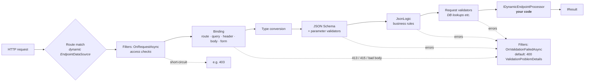
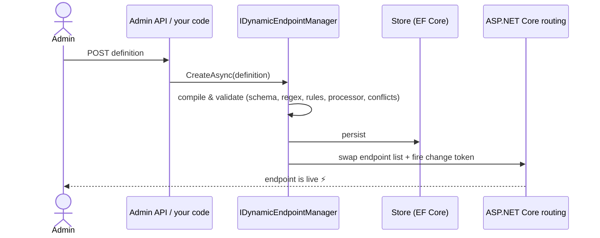

# How it works

- **Routing.** A custom `EndpointDataSource` with a change token. Each change builds a complete new endpoint list and swaps it in with a single assignment.
- **Compile once.** On save, a definition is validated as a whole and compiled: route pattern, schema, regexes, rules, processor and validator configs, validator ↔ parameter type compatibility. A broken definition never reaches the routing table.
- **Built-in engines.** A JSON Schema 2020-12 subset (`type`, `properties`, `required`, `additionalProperties`, `items`, length/range/count limits, `enum`, `const`, `format`, `uniqueItems`, `multipleOf`) and a [JsonLogic](https://jsonlogic.com) evaluator with the reference JavaScript semantics. Unsupported schema keywords and unknown operators are **rejected on save**, never silently ignored.
- **Conflicts.** Detected on save: `/orders/{id}` vs `/Orders/{orderId:int}`, clashes with the app's own endpoints, reserved prefixes.
- **Persistence.** Searchable fields are columns, the full definition is JSON, so the model can grow without migrations. `Revision` is a DB concurrency token.
